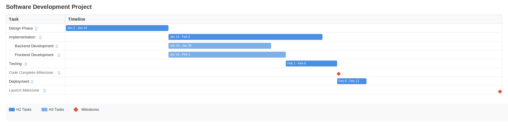

# Gantt Chart Generator

A Go CLI tool that generates beautiful Gantt charts from markdown files.



## Features

- 📝 Write project plans in readable markdown
- 📅 Flexible date formats (ISO 8601)
- 🔄 Dependency management (finish-to-start, start-to-start, finish-to-finish, start-to-finish)
- 📆 Calendar support (weekends, holidays, business days)
- 🎨 Multiple output formats: SVG, HTML, and Confluence
- 📊 Interactive formats with fixed task column and scrollable timeline
- 💨 stdin/stdout support for piping and integration
- ⚡ Fast and standalone (no dependencies at runtime)

## Quick Start

```bash
# Install
go install github.com/yourusername/gantt-gen@latest

# Generate a Gantt chart
gantt-gen project.md output.svg
```

## Example Input

```markdown
# Software Development Project

## Design Phase

| Property | Value |
|----------|-------|
| Start | 2024-01-02 |
| Duration | 14d |

## Implementation

| Property | Value |
|----------|-------|
| Duration | 21d |

| Depends On | Type |
|------------|------|
| Design Phase | finish-to-start |

### Backend Development

| Property | Value |
|----------|-------|
| Duration | 14d |

| Depends On | Type |
|------------|------|
| Design Phase | finish-to-start |

### Frontend Development

| Property | Value |
|----------|-------|
| Duration | 16d |

| Depends On | Type |
|------------|------|
| Design Phase | finish-to-start |

## Testing

| Property | Value |
|----------|-------|
| Duration | 7d |

| Depends On | Type |
|------------|------|
| Implementation | finish-to-start |
```

This generates the chart shown at the top of this README.

## Installation

### From Source

```bash
git clone https://github.com/yourusername/gantt-gen.git
cd gantt-gen
go build
```

### Using Go Install

```bash
go install github.com/yourusername/gantt-gen@latest
```

## Usage

### Basic Usage

```bash
# Generate SVG (default)
gantt-gen input.md output.svg

# Generate interactive HTML page
gantt-gen --format=html input.md output.html

# Generate Confluence-compatible HTML
gantt-gen --format=confluence input.md output.html
```

### Using stdin/stdout

Use `-` to read from stdin or write to stdout for piping and integration:

```bash
# Read from stdin, write to stdout
cat input.md | gantt-gen - - > output.svg

# Read file, write to stdout
gantt-gen input.md - > output.svg

# Read from stdin, write to file
gantt-gen - output.svg < input.md

# Pipe between commands
curl https://example.com/project.md | gantt-gen - - | compress > output.svg.gz
```

### Output Formats

#### SVG (default)
Static image suitable for:
- Embedding in documentation
- Printing or presentations
- Sharing as standalone files

#### HTML
Full interactive page with:
- Fixed task names column on the left
- Horizontally scrollable timeline on the right
- Synchronized vertical scrolling
- Perfect for reviewing large projects in a browser

#### Confluence
Minimal HTML snippet with:
- Sticky task column (stays fixed during scroll)
- Optimized for Confluence HTML macro
- Includes usage instructions in output
- Copy-paste directly into Confluence pages

## Markdown Format

Projects are defined using markdown with special table syntax:

### Task Properties

```markdown
## Task Name

| Property | Value |
|----------|-------|
| Start | 2024-01-01 |
| End | 2024-01-15 |
| Duration | 10d |
| Calendar | BusinessDays |
```

**Dates**: ISO 8601 format (YYYY-MM-DD)

**Duration**: Number followed by unit (d=days, w=weeks, m=months)

**Calendar**: Optional calendar name for business day calculation

### Dependencies

```markdown
| Depends On | Type |
|------------|------|
| Task Name | finish-to-start |
| Another Task | start-to-start |
```

**Dependency Types**:
- `finish-to-start`: Start after dependency finishes (default)
- `start-to-start`: Start when dependency starts
- `finish-to-finish`: Finish when dependency finishes
- `start-to-finish`: Finish when dependency starts

### Task Hierarchy

Use markdown heading levels to create subtasks:

```markdown
# Project Name

## Phase 1 (Level 2)

### Subtask A (Level 3)

#### Sub-subtask (Level 4)
```

### Milestones

Omit duration and end date to create a milestone:

```markdown
## Launch Milestone

| Property | Value |
|----------|-------|
| Start | 2024-03-01 |
```

### Calendars

Define custom calendars for business day calculations:

```markdown
### Calendar: BusinessDays

- Monday: 8h
- Tuesday: 8h
- Wednesday: 8h
- Thursday: 8h
- Friday: 8h
- Saturday: 0h
- Sunday: 0h
- Holiday: 2024-01-01
- Holiday: 2024-12-25
```

## Examples

See `examples/sample-project.md` for a complete example.

Generate examples in different formats:

```bash
# SVG format
gantt-gen examples/sample-project.md output.svg

# Interactive HTML
gantt-gen --format=html examples/sample-project.md output.html

# Confluence-ready HTML
gantt-gen --format=confluence examples/sample-project.md output.html

# Using stdin/stdout
cat examples/sample-project.md | gantt-gen - - > output.svg
```

Pre-generated examples are available in the `examples/` directory.

## Validation

The tool validates your input and provides helpful error messages:

```bash
$ gantt-gen project.md output.svg
Validation error: duplicate task name: Implementation
```

Common validation errors:
- Duplicate task names (must be unique)
- Task names over 200 characters
- Dependencies on non-existent tasks
- Calendar references to non-existent calendars

## Limitations

- Maximum 1000 tasks per project
- Maximum 200 characters per task name (longer names are truncated in output)
- Dependency logic uses simplified constraints

## Development

Run tests:

```bash
go test ./...
```

Build:

```bash
go build
```

## License

Apache License 2.0 - see [LICENSE](LICENSE) file for details.
